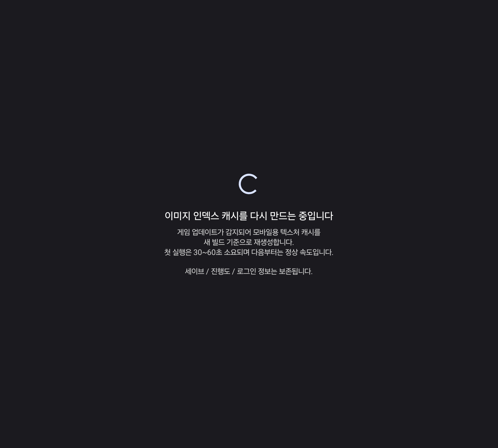
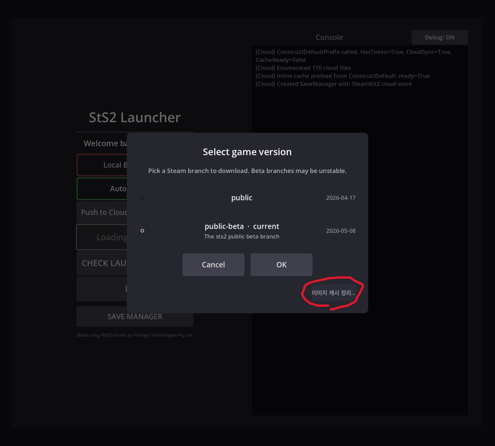
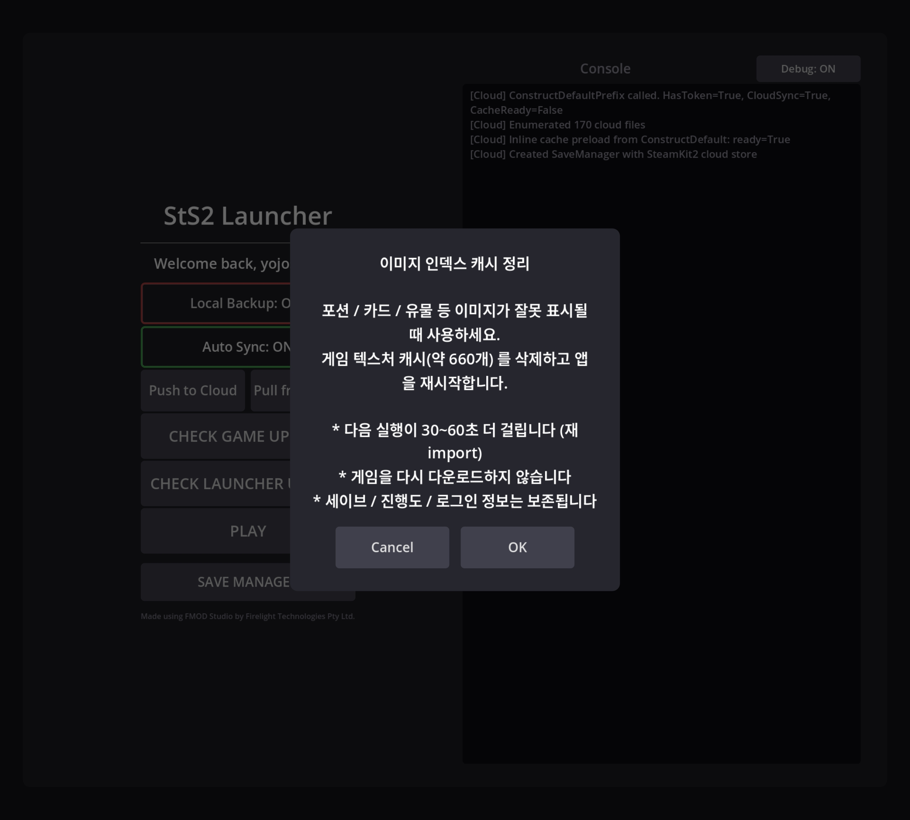
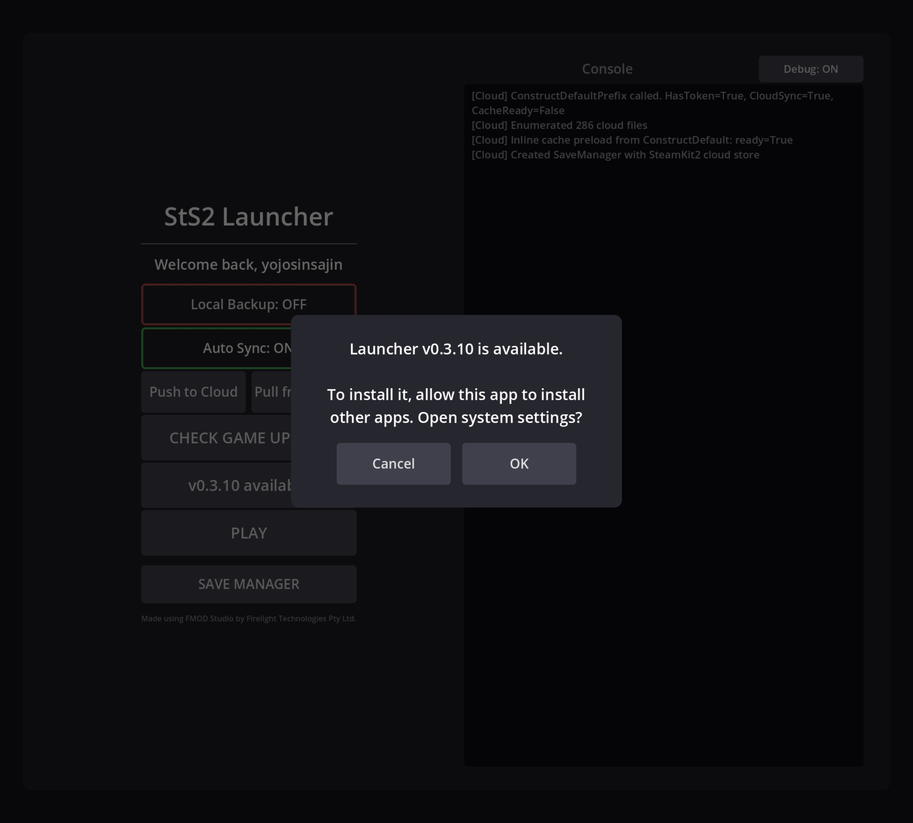
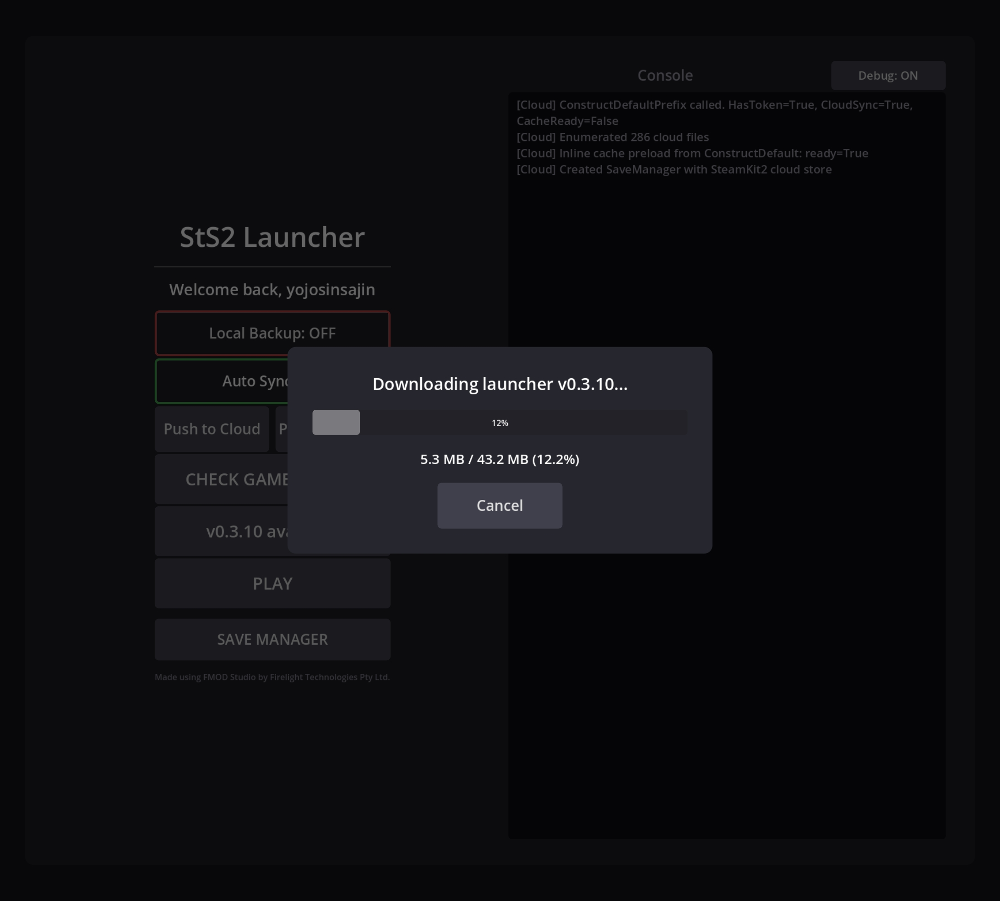
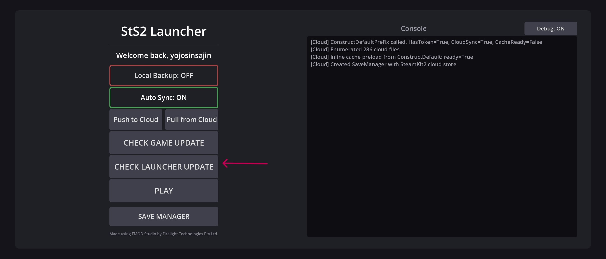
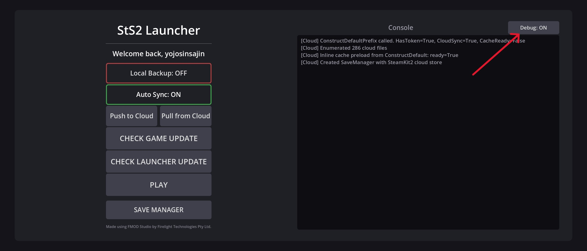
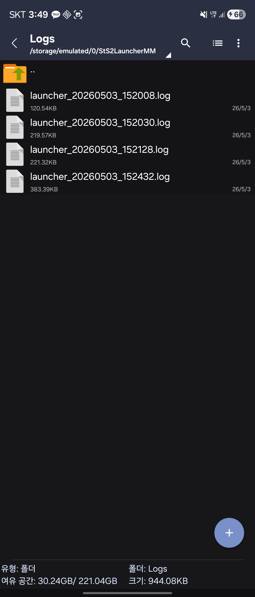

# StS2 Launcher Mod User Guide

A step-by-step guide for first-time users. Each step is explained with screenshots showing how the phone screen looks.

> **Verified environment**: Galaxy Z Fold7 (both the main and cover screens). For other form factors (tablets, etc.) see [issue #6](https://github.com/iunius612/StS2-Launcher_Mod_Manager/issues/6).

---

## Table of Contents

1. [APK Download + Install](#1-apk-download--install)
2. [First Launch — Granting Permissions](#2-first-launch--granting-permissions)
3. [Steam Login](#3-steam-login)
4. [Branch Selection + Game Download](#4-branch-selection--game-download)
5. [Main Launcher Screen at a Glance](#5-main-launcher-screen-at-a-glance)
6. [Launching the Game (PLAY)](#6-launching-the-game-play)
7. [Game Update / Branch Change (CHECK GAME UPDATE)](#7-game-update--branch-change-check-game-update)
8. [Auto Sync Toggle](#8-auto-sync-toggle)
9. [How to Use the Save Manager Dialog](#9-how-to-use-the-save-manager-dialog)
10. [Manual Push / Pull](#10-manual-push--pull)
11. [Local Backup (Save Backup)](#11-local-backup-save-backup)
12. [Installing Mods (Optional)](#12-installing-mods-optional)
13. [Launcher Auto-Update (CHECK LAUNCHER UPDATE)](#13-launcher-auto-update-check-launcher-update)
14. [Debug Logs (Debug Toggle)](#14-debug-logs-debug-toggle)
15. [Frequently Asked Questions (FAQ)](#15-frequently-asked-questions-faq)
16. [Known Issues / Unsupported Environments](#16-known-issues--unsupported-environments)

---

## 1. APK Download + Install

Download the latest `StS2Launcher-vX.Y.Z.apk` file to your phone from the [Releases page](https://github.com/iunius612/StS2-Launcher_Mod_Manager/releases/latest).

  

Installation may require allowing **"apps from unknown sources"**. The first time your phone browser or file manager installs an APK, a permission request dialog will appear once.

  

> **When upgrading**: If you install a build signed with the same keystore over the top, your saves / Steam login / game payload (~3GB) are all preserved. Minor upgrades like 0.3.x → 0.3.2 keep your data intact.

---

## 2. First Launch — Granting Permissions

When you launch the launcher for the first time, an **"All Files Access"** permission request dialog appears.

  

This permission is needed because:
- you need to be able to drop mods directly into the mods folder (`/storage/emulated/0/StS2LauncherMM/Mods/`), and
- Local Backup (save backup) requires external storage write permission to store save snapshots on external storage.

On the permission grant screen, turn the toggle on and press back to return to the launcher.

  

---

## 3. Steam Login

When the Steam login prompt appears on the launcher screen, enter your own Steam account credentials.

  

### ⚠️ Steam Guard 2FA Caution

If you switch to another app (the Steam mobile app, etc.) to receive your two-factor authentication code, **the auth session will fail even if it spends only about 5–10 seconds in the background**. You will have to enter everything from the start again.

  

**Workarounds**:
- **Popup/focus mode**: Open the Steam mobile app in a popup window to check the code → immediately tap the launcher again to keep focus.
- **Split screen**: Show the launcher and the Steam app at the same time, reading one and entering into the other.

  

---

## 4. Branch Selection + Game Download

After a successful login, if there are no game files yet, the **branch selection screen** is displayed.

  

> **Select the same branch as your PC.** You cannot bring beta branch progress from mobile into the regular branch on PC, and vice versa (Steam Cloud sync conflicts occur). See the FAQ for details.

Pick a branch and press the download button to download about **3GB** of game files. Wi-Fi recommended.

  

---

## 5. Main Launcher Screen at a Glance

This is the main launcher screen you see after the download completes. Each area's function is summarized in a single line, with detailed usage covered in the sections below.

  

| Area | Function | Details |
|---|---|---|
| **PLAY** button | Launches the game. Pressing this enters the game proper after verifying progress sync with Steam Cloud | [Section 6](#6-launching-the-game-play) |
| **CHECK GAME UPDATE** button | Check for game updates + **change branch** (from 0.3.4, CHECK FOR UPDATES was split into separate game/launcher buttons) | [Section 7](#7-game-update--branch-change-check-game-update) |
| **CHECK LAUNCHER UPDATE** button | Check whether a new launcher APK version is on GitHub + in-app download / install | [Section 13](#13-launcher-auto-update-check-launcher-update) |
| **Auto Sync** toggle | Turns automatic sync with Steam Cloud ON/OFF | [Section 8](#8-auto-sync-toggle) |
| **SAVE MANAGER** button | Check the current sync state + force re-sync dialog. Compares cloud / local + lets you decide manually | [Section 9](#9-how-to-use-the-save-manager-dialog) |
| **Push** button | Force-upload all saves to Steam Cloud (for special situations) | [Section 10](#10-manual-push--pull) |
| **Pull** button | Force-download all saves from Steam Cloud to the phone (for special situations) | [Section 10](#10-manual-push--pull) |
| **Local Backup** button | Pressing this snapshots the entire current save tree to external storage as a backup (manual). It is also backed up automatically during the PLAY handshake | [Section 11](#11-local-backup-save-backup) |
| **Debug** toggle (next to Console) | Saves logcat capture to external storage (default ON, full log from boot to game entry) | [Section 14](#14-debug-logs-debug-toggle) |

> The mod manager button was changed to the SAVE MANAGER above starting in 0.3.0. Mod installation is done with an external file manager — see [Section 12](#12-installing-mods-optional).

---

## 6. Launching the Game (PLAY)

When you press PLAY on the launcher screen, **progress sync verification with Steam Cloud** runs first.
A black screen is shown briefly, but please wait — the save manager is downloading files from the cloud.
(If it exceeds 30 seconds to 1 minute, suspect a network connection delay or a bug.)

  

Depending on the verification result, one of the following happens:

- **Both sides' progress matches, or there is no data**: Enters the game main menu immediately (no dialog appears).
- **Progress exists on only one side, or the two sides differ**: The **Save Manager dialog** is shown automatically → see [Section 9](#9-how-to-use-the-save-manager-dialog).

After this, on first launch, in-game shader scanning and decompression run.

  


Once the shader update finishes, the screen returns to the launcher main screen after a moment.

After that, entering the game proper follows the normal Slay the Spire 2 play flow.

> When quitting the game (game menu → Quit), the launcher waits until the cloud queue is empty (up to 5 minutes, usually 1–5 seconds). During this time the process stays alive in the background and you may briefly see Steam network traffic — this is normal behavior.

---

## 7. Game Update / Branch Change (CHECK GAME UPDATE)

> **Changed from 0.3.4**: The old `CHECK FOR UPDATES` button did both the game manifest comparison and the launcher APK version comparison at once, and the result display was just a large status indicator on the game side. Now the two flows are fully separated, with **`CHECK GAME UPDATE`** (this section) and **`CHECK LAUNCHER UPDATE`** ([Section 13](#13-launcher-auto-update-check-launcher-update)) each having their own button / result / dialog.

Even if you have already downloaded the game, pressing the **CHECK GAME UPDATE** button reopens the branch selection screen. Use it when you want to switch to a different branch (e.g. `public` → `public-beta`).

  

### Cautions When Changing Branches

- **A new branch is a full re-download** (~3GB). Delta download is not used — binary differences between branches may not be byte-compatible, so it intentionally re-downloads from scratch.
- **Saves / Steam login / mod settings are preserved.** Only the game files (`game/`, `download_state/`) are downloaded anew.
- **Match the branch with your PC** — different branches can cause Steam Cloud sync conflicts. See the branch-matching item in the [FAQ](#13-frequently-asked-questions-faq).

### Recovering from Broken Image Indices — Clearing the Image Cache (v0.3.19+)

If, after a game update, icons for **cards / relics / potions** etc. are incorrectly displayed as different images, it is because the mobile texture cache (ETC2-compressed copy) remains based on the old build. From v0.3.19, two recovery paths are provided.

**Automatic (no user intervention needed in most cases)**

  

When a game update (PCK file refresh) is detected, the texture cache is automatically regenerated on the next app launch. A Korean loading screen ("Rebuilding the image index cache") is shown for 30–60 seconds, and once it finishes, the app enters normally. Saves / progress / login info are all preserved.

  

**Manual — the `Clear Image Cache` button**

  
  
Use this when auto-detection was missed or you want to explicitly clear it again:

1. Press **CHECK GAME UPDATE** on the main screen
2. There is a small gray **`Clear Image Cache`** button at the **bottom right** of the branch selection dialog
3. Pressing it shows a Korean confirmation dialog (describing the operation + a 30–60 second notice + what is preserved)
4. **OK** → the app restarts automatically → after the same loading screen as the auto flow above, it enters normally

**Preserved vs. Regenerated:**

| Item | Behavior |
|---|---|
| Game PCK / download data (`game/`, `download_state/`) | **Preserved** — no re-download |
| Saves / progress (`steam/<userId>/...`) | **Preserved** |
| Steam login / Auto Sync settings | **Preserved** |
| Local Backup snapshots (`StS2LauncherMM/Saves/`) | **Preserved** — on external storage, unaffected by clearing the app cache |
| Mobile texture cache (`etc2_cache/.godot/imported/`) | **Regenerated** (~30–60 seconds) |

It achieves the same effect as the pre-auto-flow recovery method of "clearing app data then reinstalling," handled in 30 seconds without re-downloading the game. See [issue #23](https://github.com/iunius612/StS2-Launcher_Mod_Manager/issues/23) for details.

---

## 8. Auto Sync Toggle

The **Auto Sync: ON / OFF** toggle on the launcher main screen lets you turn Steam Cloud automatic sync off or on.

  

| State | Behavior |
|---|---|
| **Auto Sync: ON** (default) | Saves are automatically pushed to Steam Cloud during play, with an automatic verification dialog on the next PLAY |
| **Auto Sync: OFF** | Isolated from the cloud. Saves are stored only in mobile local. Progress does not sync with other devices (PC, etc.) |

### When to Leave It OFF?

Almost always keep it ON. Special situations where OFF is needed:

- **Temporary debugging**: When cloud-side sync is suspect, leave it OFF and proceed with only the mobile local copy → then turn it back ON and make an accurate decision via the Save Manager.
- **When you intentionally want different progress from PC**: When you want to progress a separate character/run on mobile and keep the PC separate. Note that the next time you turn it ON, a conflict dialog will appear, and you'll need to decide then.

If you turn it ON again after it was OFF, the **Save Manager automatically detects the conflict** and asks which side to keep — the dialog appears at the next PLAY.

---

## 9. How to Use the Save Manager Dialog

When a progress difference is detected between Steam Cloud and the phone, the dialog is displayed automatically. Alternatively, tapping the **SAVE MANAGER** button directly on the launcher screen lets you check the current sync state at any time.

### Dialog Layout

Each card shows the progress information for one profile.

| Item | Meaning |
|---|---|
| **Profile N** (subtitle) | Which profile's data the card is for (1, 2, 3, or a mod profile) |
| **Recent** badge | The side that was changed more recently of the two cards (the newer of the mtimes of progress.save and current_run.save) |
| **File creation time / File size** | The mtime / size of progress.save |
| **Total playtime** | Accumulated play time |
| **Current progress** | If there is a run in progress, shows it like `Act 1 Floor 3`. If none, `—` |
| **Record / Highest ascension / Floors climbed / Relics discovered** | Accumulated statistics from progress.save |

### Dialog Appearance by Situation

#### Situation 1 — Different (conflict)

Body "Progress differs" + two cards + **Cancel / Keep Local / Keep Cloud** buttons. If multiple profiles differ at the same time, the body shows `(N profiles)`.

  

### Guide to Deciding Which Side to Keep

The dialog automatically highlights the button for the newer side (the Keep button on the card with the "Recent" badge). A typical decision flow:

| Situation | Choice |
|---|---|
| Just progressed on mobile → want to pass it to another device | **Keep Local** |
| Progressed on PC and want to bring it to mobile | **Keep Cloud** |
| If unsure | **Cancel** → cloud sync OFF for that session, can decide again at the next start |

> **To be safe when uncertain**: Look at the "Current progress" row. Of the two cards, the side that has a run in progress, or the more advanced one (e.g. Act 1 Floor 5 vs Act 1 Floor 3), is usually the data you don't want to lose.

#### Situation 2 — Both Identical

The two cards' size/stats/current progress are all the same. Body "They match; no separate action is needed" + Close button.

  

---

## 10. Manual Push / Pull

The **Push** / **Pull** buttons in the launcher's Actions area are force-sync tools. **They are not recommended for normal use** — cloud sync is handled automatically when the game quits/launches, and if auto-sync breaks, the Save Manager provides accurate decision options.

  

| Button | Behavior |
|---|---|
| **Push** | Force-uploads all of mobile local's saves (progress + current_run + history `.run` + prefs + settings × all profiles) to Steam Cloud |
| **Pull** | Force-downloads all of Steam Cloud's saves to mobile local |

### When to Use?

For special situations only:

- **When the Save Manager doesn't work for some reason** (dialog unresponsive, etc.) — when you need to force a one-direction sync.
- **When moving from PC to mobile after progressing**, the Save Manager handles it automatically, but if you want to explicitly fetch it all at once, use Pull.

> Normal use is well served by the **automatic verification at PLAY + Save Manager dialog** flow.

---

## 11. Local Backup (Save Backup)

So that you can roll back when a save is wrongly overwritten, the entire save data is copied to external storage **keeping the original folder structure**. Backups are made in two ways.

- **Manual backup** — When you press the **Local Backup** button in the launcher's Actions area, a confirmation dialog appears → (on confirm) it snapshots the entire current save tree at once. When done, it shows the number of backed-up files, total size, and storage location in a result dialog.

  

- **Automatic backup** — Created automatically once per launch during the Steam Cloud handshake that runs when you press PLAY. If local and cloud match, it snapshots one copy of the local tree; if there is a conflict, it backs up both the **kept** side and the **discarded** side (so you can recover the discarded data even if you choose wrongly).

> Backup filenames are **not altered** (no `.bak` suffix or the like). They are copied with the original filenames and folder structure intact, so restoring is just a matter of copying the file back to its original location.

### Storage Location / Structure

Under external storage `/storage/emulated/0/StS2LauncherMM/Saves/`, it is split **by backup type**, within which there is a backup-time (`<ts>` = `yyyyMMdd_HHmmss`) folder, and within that, the original save tree is placed as-is.

```
StS2LauncherMM/Saves/
  ├── manual/<ts>/<original tree>                   (Local Backup button = manual)
  └── auto/
      ├── <ts>_match/<original tree>                 (handshake: when local=cloud match)
      └── <ts>_conflict/
          ├── kept/<original tree>                   (handshake conflict: the kept side)
          └── discarded/<original tree>              (handshake conflict: the discarded side)
```

Here `<original tree>` is the actual path the game uses, as-is:

```
steam/<SteamID>/[modded/]profile<N>/saves/<filename>
   e.g.) steam/76561198xxxxxxxxx/profile1/saves/progress.save
         steam/76561198xxxxxxxxx/modded/profile2/saves/current_run.save
```

(The `modded/` segment is attached only to profiles played with mods enabled. Empty saves are not included in the snapshot.)

### Retention Policy

- **Manual backups (`manual/`) are not deleted automatically.** They are intentionally created backups, so they remain until you clean them up yourself.
- **Automatic backups (`auto/`) keep only the latest 10 sets**, and sets older than that are automatically deleted oldest-first (one `<ts>_match` and one `<ts>_conflict` each count as one set).

### How to Recover

1. With an external file manager (or `adb pull` from a PC), open the desired backup folder under `StS2LauncherMM/Saves/`. Judge which point in time it is from by the folder name's timestamp and type (`_match`/`_conflict`).
2. **With the game closed**, copy the files inside the backup back to the game's actual save location. Since the filenames and folder structure already match the original, you can just overwrite.

> Note: There is **no UI yet that restores automatically from external to internal.** Handle it with the manual copy described above.

---

## 12. Installing Mods (Optional)

To use mods:

1. We recommend downloading and using **[ZArchiver](https://play.google.com/store/apps/details?id=ru.zdevs.zarchiver)** (free on the Play Store). Some OEM default file managers, such as Samsung **My Files**, may not show the `/storage/emulated/0/StS2LauncherMM/` path due to Android scoped storage policy (verified in practice).
2. With ZArchiver, navigate to the `/storage/emulated/0/StS2LauncherMM/Mods/` path.
3. Copy the entire mod folder (e.g. `MyMod/`) into it. The folder must contain a `.dll`, an optional `.pck`, and a `<ModId>.json` manifest. (Same as PC, no difference.)

  
  
  

4. When the game proper shows the **"Load mods?"** dialog at launch, tap OK. Once you choose, it loads automatically from then on.

  

---

## 13. Launcher Auto-Update (CHECK LAUNCHER UPDATE)

You can handle the launcher APK's own update in-app (from 0.3.4). Previously, even when a new launcher version was released, the result was buried in a single console log line, but now it notifies you explicitly with a dialog, and a single OK takes you through download / install / automatic restart.

### Automatic Check (Once at Boot)

After the launcher boots, when it enters the launch stage, it automatically compares against GitHub `releases/latest`. If there is a new version, the dialog appears immediately. If already up to date, it passes silently (no notification).

  
  

### CHECK LAUNCHER UPDATE Button (Manual)

You can check manually at any time with the **CHECK LAUNCHER UPDATE** button located above the PLAY button. Behavior by result:

| Result | Behavior |
|---|---|
| **New version available** | "Launcher v0.X.Y is available. Download and install now?" dialog → on OK, download → install |
| **Already latest** | "You're already on the latest launcher version. Open the GitHub releases page anyway?" dialog (for confirmation) |
| **Check failed** (network, etc.) | "Failed to check for launcher updates" dialog + error message |

  

### Permission Flow on First Use

On the first download attempt, Android requires the **Allow app installs from this source** (REQUEST_INSTALL_PACKAGES) toggle (Android 8+):

1. Launcher dialog OK → automatically jumps to the system settings screen.
2. Turn the **Allow from this source** toggle ON in system settings → press back.
3. Return to the launcher → tap CHECK LAUNCHER UPDATE again → this time, the download progress dialog.
4. Download completes → Android system install screen launches automatically → **Update** → the app restarts automatically.

> Signed with the same keystore, so saves / Steam login / game payload (~3GB) are all preserved.
>
> For releases with no APK attached, there is a fallback that automatically opens the GitHub releases page in the browser.

---

## 14. Debug Logs (Debug Toggle)

When a problem occurs in the launcher, the logcat output needed for analysis is automatically captured to external storage (from 0.3.6). Controlled by the **Debug: ON / OFF** toggle next to the console.

  

### How It Works

- **Default ON** — On since the first boot, so even cases where the launcher freezes right after starting are automatically logged.
- Captures only its own PID's logcat (`logcat --pid <self>`) — no extra permissions needed.
- **Auto-start at boot** — Captured from the `onCreate` stage, so it includes everything down to the .NET / FMOD / BCL boot logs.
- Flushes immediately per line — logs are preserved even after a force-kill / crash.
- To keep storage from accumulating indefinitely, **keeps at most 20**, automatically deleting the oldest first.

### Storage Location

```
/storage/emulated/0/StS2LauncherMM/Logs/
  ├── launcher_<YYYYMMDD>_<HHMMSS>.log  (a new file for each launch)
  └── ...
```

  

### Usage Flow

When reporting a problem:
1. Navigate to the path above with an external file manager (ZArchiver recommended).
2. Among the **launcher_*.log** files, find the one from when the problem occurred (usually the most recent) and move it to a PC or attach it via messenger, etc.
3. Please attach it to the issue tracker → [iunius612/StS2-Launcher_Mod_Manager/issues](https://github.com/iunius612/StS2-Launcher_Mod_Manager/issues)

### Debug Toggle OFF

If you don't want capture due to storage / privacy concerns, turn the toggle OFF. Even after turning it OFF, it is saved to SharedPreferences and applies from the next launch (any capture currently in progress stops immediately). Turning it ON again starts capturing to a new file from that point (since the app is already booted, the logs right after boot are missed — if you want the full launch log, turn the toggle ON then restart the app).

---

## 15. Frequently Asked Questions (FAQ)

### Q. Does sync work even if the PC and mobile branches differ?

It depends.

- **Two branches with the same save schema** (e.g. both differing by a minor update) will keep cloud-syncing as-is.
- **A branch difference with a schema change** (e.g. PC on public, mobile on public-beta — if beta added a new field), Steam Cloud will throw a "sync conflict" dialog, and recovery can become difficult.

**The safest cross-device transition procedure** (verified once):
1. PC Steam → StS2 properties → in the Betas tab, select **the same branch as mobile**.
2. Run PC StS2 once → close it after reaching the main menu. During this process, the PC's saves are pushed to the cloud under the new branch schema.
3. PLAY on the mobile launcher → once the Save Manager dialog correctly recognizes the new cloud data, fetch it via KeepCloud or the automatic flow.

This procedure is **not always necessary** — if the branch difference is trivial, it just syncs. But it is the canonical recovery path when a conflict occurs.

### Q. I pushed wrong data to the cloud. Can I recover?

If it's the PC side, the [shrederr/sts2-progress-rebuild](https://github.com/shrederr/sts2-progress-rebuild) tool reconstructs `progress.save` from the `.run` history and recovers all the way to the cloud.

If only the mobile local is wrong (the cloud is fine), fetch it with the Save Manager's **Keep Cloud** to recover.

If you have a Local Backup snapshot, you can restore directly from `/storage/emulated/0/StS2LauncherMM/Saves/{manual,auto}/<ts>/...`. In particular, on a handshake conflict, the **discarded-side data** remains intact in `auto/<ts>_conflict/discarded/`, so you can roll back even if you chose KeepLocal/KeepCloud wrongly. (See [Section 11](#11-local-backup-save-backup))
  

### Q. The Save Manager says "conflict" every time.

There are cases where the PC and mobile each normalize progress.save slightly differently — the stats are identical but the size differs by a few KB every time. The destructive-blocking logic in 0.3.2 is safe even in this case, but for UX the dialog pops up each time. Being tracked separately.

In this case, choose either **Keep Local** or **Keep Cloud**, whichever is visually newer (the device you just played on).

### Q. After quitting the game, the cloud upload seems to take a while?

That's normal. Since 0.3.0, at the menu → Quit point, the launcher waits until the cloud queue is completely empty (up to 5 minutes, usually 1–5 seconds). During this time the process stays alive in the background and Steam network traffic may be visible.

### Q. If I force-close the phone by swiping it away in the task switcher, does data loss occur?

Since 0.3.2, it recovers automatically. Even if the cloud queue is not fully emptied right after the swipe, on the next boot `SaveProgressComparer` accurately detects the local-newer side and pushes it to the cloud.

That said, quitting normally via **menu → Quit** when possible is the safest.

### Q. I want to download the game again.

If you select a different branch with CHECK GAME UPDATE, it automatically does a full re-download. If you want to re-download the same branch, just press it twice in the order: a different branch → then the original branch.

---

## 16. Known Issues / Unsupported Environments

| Issue | Status |
|---|---|
| Launcher entry fails on some tablets (Lenovo Y700/Y704, etc.) | [issue #6](https://github.com/iunius612/StS2-Launcher_Mod_Manager/issues/6) — collecting device logs |
| PC ↔ phone progress.save size divergence (a conflict dialog appears once on each device switch) | Tracked separately — destructive impact was blocked in 0.3.2 |

If you find a new problem, please file it on the [issue tracker](https://github.com/iunius612/StS2-Launcher_Mod_Manager/issues). Attaching a log captured with `adb logcat -d > sts2.log` is a great help for analysis.

---

## Helpful Commands (Optional)

If you've connected your phone to a PC via USB debugging:

```bash
# View launcher logcat
adb logcat -s DOTNET:I STS2Mobile:V godot:V

# View external storage mods/saves folders
adb shell ls -la /storage/emulated/0/StS2LauncherMM/Mods/
adb shell ls -la /storage/emulated/0/StS2LauncherMM/Saves/

# Force reset (delete all data and start like a new user)
adb shell pm clear com.game.sts2launcher.modmanager
adb shell rm -rf /storage/emulated/0/StS2LauncherMM
```

---

*This document is part of [iunius612/StS2-Launcher_Mod_Manager](https://github.com/iunius612/StS2-Launcher_Mod_Manager). If there is incorrect information or items you'd like to add, please let us know via a PR or issue.*
